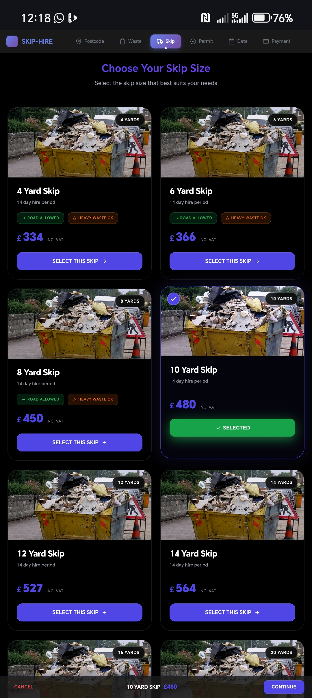
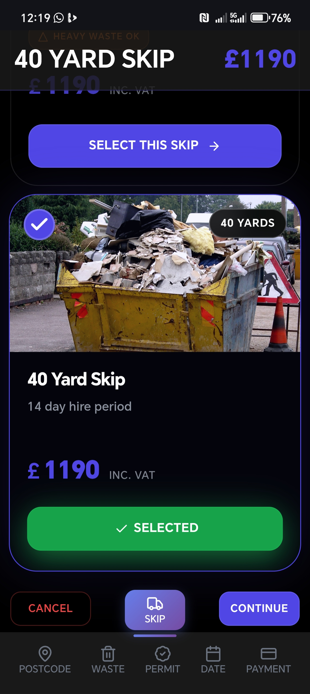
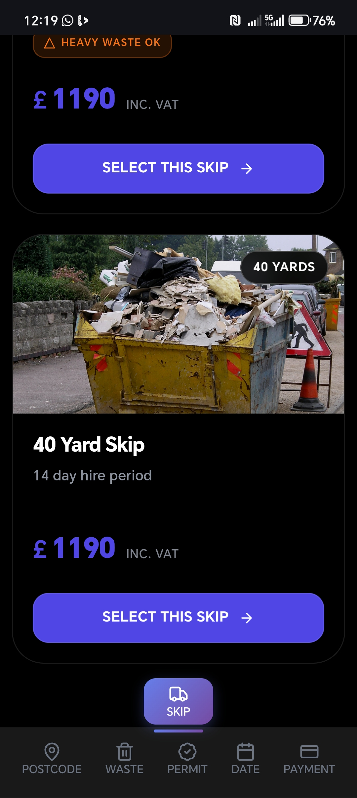
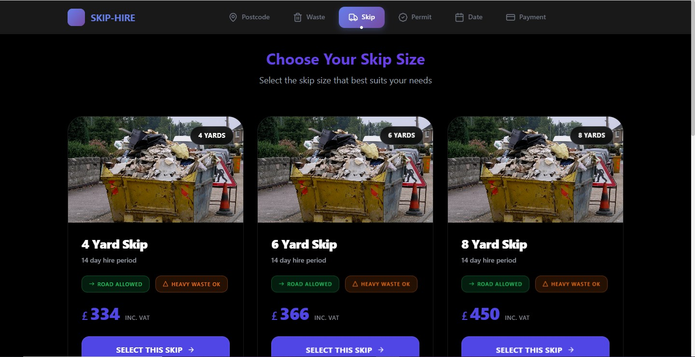
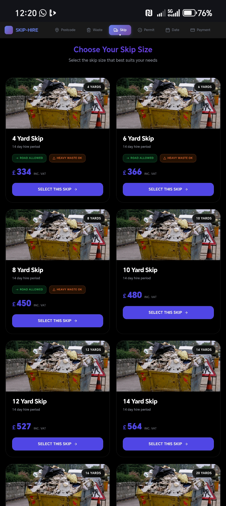

# REMWaste - https://wewantwaste-lake.vercel.app


---------------------------------------------------------------------------------------------------


---------------------------------------------------------------------------------------------------


---------------------------------------------------------------------------------------------------


---------------------------------------------------------------------------------------------------


---------------------------------------------------------------------------------------------------

Redesigned the SKIP page to look more modern. This project focuses on enhancing the user interface and experience of the existing waste management platform with contemporary design principles and improved functionality.

## Features

- **User-friendly Interface** - Clean, responsive design for optimal user experience
- **API Integration** - Seamless integration with waste management backend services

## Prerequisites

Before you begin, ensure you have the following installed on your system:

- **Node.js** (version 16.0 or higher)
- **npm** (version 7.0 or higher) or **yarn**
- **Git**

You can verify your installations by running:
```bash
node --version
npm --version
git --version
```

## Installation

1. **Clone the repository**
   ```bash
   git clone https://github.com/Oscarpoco/REMWaste.git
   cd REMWaste
   ```

2. **Install dependencies**
   ```bash
   npm install
   ```
   or if you prefer yarn:
   ```bash
   yarn install
   ```

3. **Environment Setup**
   
   Create a `.env` file in the root directory and add the following configuration:
   ```env
   VITE_API_BASE_URL=https://app.wewantwaste.co.uk/api
   ```

4. **Start the development server**
   ```bash
   npm run dev
   ```
   or with yarn:
   ```bash
   yarn dev
   ```

   The application will be available at `http://localhost:5173` (or another port if 5173 is occupied).

## Build for Production

To create a production build:

```bash
npm run build
```

To preview the production build locally:

```bash
npm run preview
```

## Project Structure

```
REMWaste/
├── public/               # Static assets
├── src/                  # Source code
│   ├── components/       # Reusable components
│   ├── styles/           # Styles components
│   ├── assets/           # images
│   └── main.js           # Application entry point
├── images/               # Project screenshots and images
├── .env                  # Environment variables
├── package.json          # Project dependencies and scripts
└── vite.config.js        # Vite configuration
```

## Available Scripts

- `npm run dev` - Start development server
- `npm run build` - Build for production
- `npm run preview` - Preview production build
- `npm run lint` - Run linting checks

## API Configuration

The application connects to the WeWantWaste API. The base URL is configured in the `.env` file:

```env
VITE_API_BASE_URL=https://app.wewantwaste.co.uk/api
```

Make sure this URL is accessible and the API is running for full functionality.

## Contributing

1. Fork the repository
2. Create your feature branch (`git checkout -b feature/AmazingFeature`)
3. Commit your changes (`git commit -m 'Add some AmazingFeature'`)
4. Push to the branch (`git push origin feature/AmazingFeature`)
5. Open a Pull Request


## Contact

**Oscar Kyle Poco**
- Email: oscarkylepoco@gmail.com
- Phone: 0660850741
- LinkedIn: [oscarkylepoco](https://linkedin.com/in/oscar-kyle-poco-71528016b/)
- GitHub: [@Oscarpoco](https://github.com/Oscarpoco)

## Support

If you encounter any issues or have questions about REMWaste, please:

1. Check the existing [Issues](https://github.com/Oscarpoco/REMWaste/issues)
2. Create a new issue if your problem isn't already reported
3. Contact the developer directly using the information above

---

**REMWaste** - Revolutionizing Waste Management Through Technology
